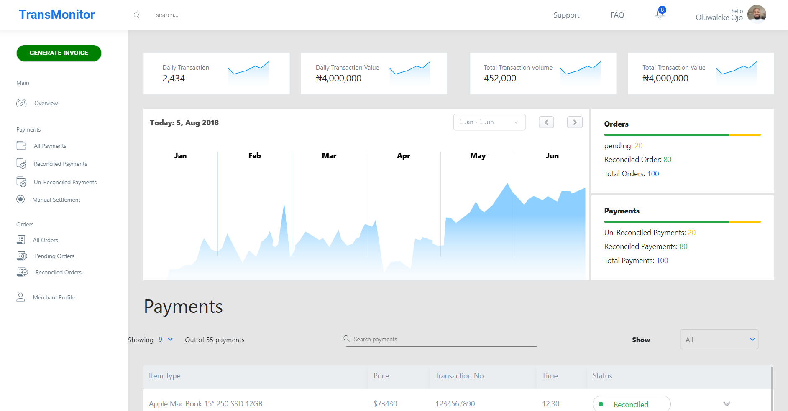

# transmonitor

Site: [TransMonitor DashBoard](https://transmonitor-joel.netlify.com/)




## Running the Project
Run yarn install to download and update dependencies
```
yarn install
```

Start the development server
```
yarn start
```

Build and Optimise for Production
```
yarn run build
```
